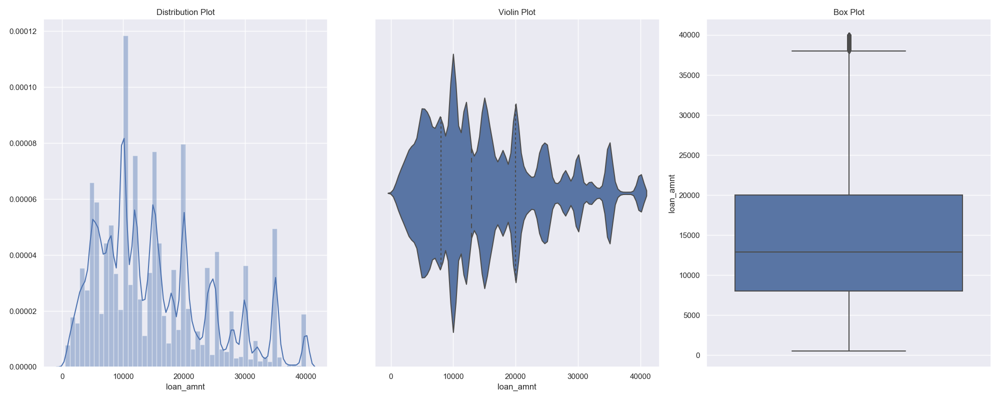
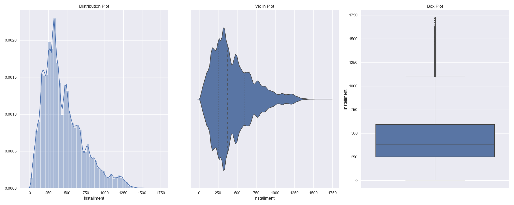
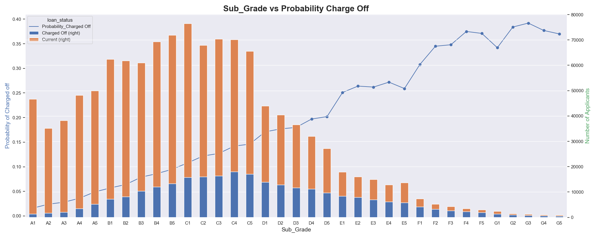

# Lending Club


## Table of contents
1. [Introduction](#Introduction)
2. [Motivation](#Motivation)
3. [Data Source](#Data-Source)
4. [Process](#Process)
    1. [Data Cleaning](#Data-Cleaning-see-code-here)
    2. [Exploratory Data Analysis](#Exploratory-Data-Analysis-see-code-here)
    3. [Prototype of Data pipline](#Prototype-of-Data-pipline) 
5. [Future Direction](#Future-Improvements)
6. [Project Structure](#Project-Structure)


## Introduction
LendingClub.com was founded in 2005. Annual returns on peer-to-peer lending are higher and more attractive compare to the saving rates and bond yields, but riskier. The number of issued loans increased dramatically over the years in Lending Club from 21K in 2011 to 47 billion in 2019. Therefore, there has been increasing demands for intelligently automated programs to pick up the “Right Loan” to get risk-free or low-risk returns of the loan investments as typical fixed income investors expect. 

In this project, based on the lending club's data, containing more than 226k rows and 145 columns, The objective is to extract useful information for exploratory data analysis, by way of  data cleaning, and then build a prototype of production data pipeline, which would allow data scientists and data analysts to interactively and meaningfully query and explore the data. In addition, it will be used for machine learning model training and evaluation.

The 'mini' data pipeline should achieve the following standards:
- Create a relational data model / schema in a database or storage engine
- Develop code that will persist the dataset into this storage system in a fully automated way
- Include any data validation routines if necessary


## Motivation
 1. EDA: Lending club loan data cleaning and exploratory data analysis
 2. Data pipeline: Build a prototype of production data pipeline to support software engineers, data scientists and data analysts.


## Data Source
Lending club loan data (2007-2015) is stored in Kaggle as a csv file: https://www.kaggle.com/wendykan/lending-club-loan-data


## Process
### Data Cleaning (see code [here](src/python/data_cleaning.py))
The data source contains 145 features. It was messy with a lot of missing values for some features and unstructured string data that needed to be cleaned and transformed.
This is the steps of cleaning the dataset:
1. Drop feature if it has missing 50% values of that record
 
    A feature has more than 50% missing values don't provide enough information for modeling and data analysis.
2. Drop feature if 95% values of it are the same 
 
    A feature has 95% values don't provide useful information for modeling and data analysis.
3. Drop feature if it is the same as other features (I might only choose to use one of them)

    For the following example, 'title' and 'purpose' have similar distribution of values, I choose title rather than purpose
```            
              title   
Value                      Percentage 
Debt consolidation         51.547438
Credit card refinancing    20.993250
Home improvement            6.142867
Other                       5.708289
Major purchase              2.004163
                             ...    
HomeFloors                  0.000045
poor mom                    0.000045
NUMBER 2 LOAN               0.000045
Good-bye citi               0.000045
home remodel project        0.000045
```
```
             purpose
Value                      Percentage  
debt_consolidation         56.526522
credit_card                22.868064
home_improvement           6.655422
other                      6.168088
major_purchase             2.231420
medical                    1.215924
small_business             1.092111
car                        1.062208
vacation                   0.686744
moving                     0.681347
house                      0.625302
wedding                    0.104173
renewable_energy           0.063919
educational                0.018756
```

4. Drop feature if the features are highly correlated (|r| >0.8) (I might only choose to use one of them)
 
    From machine learning perspective, highly correlated features will perform similar for models.
5. Derive some new columns based on domain knowledge that will be helpful for machine learning models and data analysis
    
    For the following example, I calculated the ratio of amount of loan and annual income because the radio will directly influence the ability to pay debts
    
    ```
    loan['loan_income_ratio'] = loan['loan_amnt']/loan['annual_inc']
    ```

### Exploratory Data Analysis (see code [here](src/python/exploratory_data_analysis.py))
#### Univariate Analysis

Please take a look at the first graphs of distributions for loan amount and installment, most of the loan amount sit in the range of (0, 20000), most of the installment of loan sit in the range of (0, 750). It shows for peer-to-peer lending, the size of each loan is not large.
   


#### Bivariate/Multivariate Analysis

The following pictures show the probability of charge-off for loan among different states and loan grade.

California, Florida, New York and Texas have a large number of customers and have comparatively high probability of charge-off, it makes sense because these states are highly developed and have large population mobility.


For the sub_grade of loan, the charge-off probability is increasing as the sub_grade decreases, it shows the loan rating is reasonable.


### Prototype of Data pipline 
#### Design Schema for Database (see code [here](src/PostgreSQL/create_schema.sql))
I choose the star schema for the relational database which stored the processed structure data.
This is the finalized star schema:

Reasons I choose relational database and star schema:
 1. Avoid redundancy as data grows
 2. A good fit for interactive query and data analysis especially if a use case focuses on data analysis in terms of a category feature, such as loan grade or employment title
 3. Easy to maintain and understand the relaionship between features
 
#### ETL process (see code [here](src/python/build_database.py))
Current Data Pipeline:

Future Data Pipeline:


## Future Direction
1. Computing tool consideration:
   
   The loan data from 2007 to 2015 is about 1GB, it is comparatively efficient to use pandas do computation. If the data is growing in the future, I would consider use spark running the ETL process on cloud services like AWS.
   
2. Relational database consideration:

   Because the data size is only 1GB, I use PostgreSQL for storage.
   
   As the data volume is growing I will use distributed and columnar database like Redshift or Snowflake as a data warehouse for storage. (The project I did here: https://github.com/xuzifan08/Trending_of_Reddit/blob/master/src/spark/read_process.py) will provide reusable code)
   
3. Airflow

   When the data is processed by spark on cloud-based services, I would consider to use Airflow to schedule spark job (The project I did here: https://github.com/xuzifan08/Trending_of_Reddit/blob/master/src/airflow/schedule.py will provide the reusable code)
   
5. Use cases
   
   The 'mini' data warehouse can support data scientists to predict whether a customer will pay back loan on time or not.
   
   The 'mini' data warehouse can support data analysts to analyze how the category features influence whether the loan is paid back or not.
   
 
## Project Structure   
 ```
├── README.md
├── src
│    ├── python
│    │    ├── __init__.py
│    │    ├── build_database.py
│    │    ├── data_cleaning.py
│    │    ├── exploratory_data_analysis.py 
│    │    └── run.sh
│    └── PostgreSQL
│         └── create_schema.sql
│    
├── docs
│    ├── LendingClubStarSchema.png
│    ├── README.md
│    ├── binary_analysis.png
│    └── uni_analysis.png
│
└── run.sh
``` 
