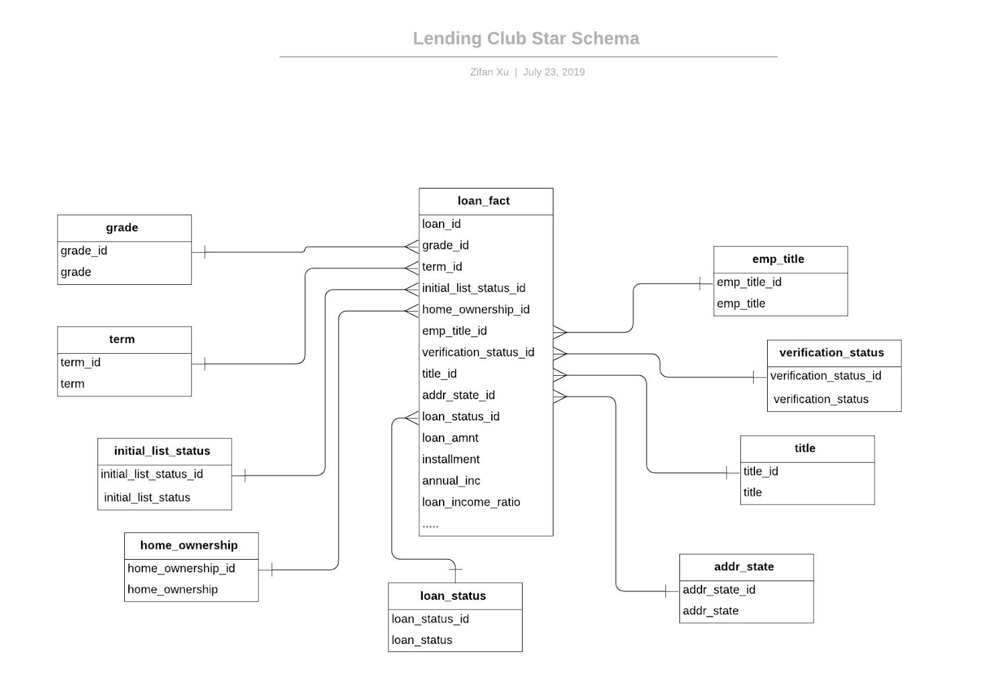

# Lending Club


## Table of contents
1. [Introduction](#Introduction)
2. [Motivation](#Motivation)
3. [Data Source](#Data-Source)
4. [Process](#Process)
    1. [Data Cleaning](#Data-Cleaning-see-code-here)
    2. [Exploratory Data Analysis](#Exploratory-Data-Analysis-see-code-here)
    3. [Prototype of Data pipline](#Prototype-of-Data-pipline-see-code-here) 
5. [Project Structure](#Project-Structure)
6. [How to run](#How-to-run)
7. [Future Improvements](#Future-Improvements)


## Introduction
LendingClub.com was founded in 2005. Annual returns on peer-to-peer lending are higher and more attractive compare to the saving rates and bond yields, but riskier. The number of issued loans increased dramatically over the years in Lending Club from 21K in 2011 to 47 billion in 2019. Therefore, there has been increasing demands for intelligently automated programs to pick up the “Right Loan” to get risk-free or low-risk returns of the loan investments as typical fixed income investors expect. 

In this project, based on the lending club's data, containing more than 226k rows and 145 columns, The objective is to extract useful information for exploratory data analysis, by way of  data cleaning, and then build a prototype of production data pipeline, which would allow data scientists and data analysts to interactively and meaningfully query and explore the data. In addition, it will be used for machine learning model training and evaluation.

The 'mini' data pipeline should achieve the following standards:
- Create a relational data model / schema in a database or storage engine
- Develop code that will persist the dataset into this storage system in a fully automated way
- Include any data validation routines if necessary


## Motivation
 1. EDA: Lending club loan data cleaning and exploratory data analysis
 2. Data pipeline: Build a prototype of production data pipeline to support software engineers, data scientists and data analysts.


## Data Source
Lending club loan data (2007-2015) is stored in Kaggle as a csv file: https://www.kaggle.com/wendykan/lending-club-loan-data


## Process
### Data Cleaning (see code [here](src/python/data_cleaning.py))
The data source contains 145 features. It was messy with a lot of missing values for some features and unstructured string data that needed to be cleaned and transformed.
This is the steps of cleaning the dataset:
 1. Drop feature if it has missing 50% values of that record
 
    why drop it?
 2. Drop feature if 95% values of it are the same
 
    why drop it?
 3. Drop feature if it is the same as other feature (I might only choose to use one of them)
    
    show a example for duplicate and why drop it?
 4. Drop feature if the features are highly correlated (|r| >0.8) (I might only choose to use one of them)
 
    why drop it?
 5. Derive some new columns based on domain knowledge that will be helpful for machine learning models and data analysis
    
    show a example and explain why it's useful

### Exploratory Data Analysis (see code [here](src/python/exploratory_data_analysis.py))
#### Univariate Analysis

explain the findings and use case for business 


#### Bivariate/Multivariate Analysis
explain the findings and use case for business 


### Prototype of Data pipline 
#### Design Schema for Database (see code [here](src/PostgreSQL/create_schema.sql))
I choose the star schema for the relational database which stored the processed structure data.
This is the finalized star schema:

Reasons I choose relational database and star schema:
 1. Avoid redundency as data grows
 2. A good fit for interactive query and data analysis especially if a use case focuses on data analysis in terms of a category feature, such as loan grade or employment title
 3. Easy to maintain and understand the relaionship between features
 
#### ETL process (see code [here](src/python/build_database.py))
draw picture of data pipeline and future data pipeline


## Future direction
1. Computing tool consideration:
   
   The loan data from 2007 to 2015 is about 1GB, it is comparatively efficient to use pandas do computation. If the data is growing in the future, I would consider use spark running the ETL process on cloud services like AWS.
   
2. Relational database consideration:

   Because the data size is 1GB, so use postgreSQL for storage
   Maybe future I will use redshift (link to reddit data) or snowflake
   
3. Data science use case
   
   Predict loan pay back on time or not
   
   Predict how the category features influence whether the loan is paid back
   
 
## Project Structure   
 ```
├── README.md
├── src
│    ├── python
│    │    ├── __init__.py
│    │    ├── build_database.py
│    │    ├── data_cleaning.py
│    │    ├── exploratory_data_analysis.py 
│    │    └── run.sh
│    └── PostgreSQL
│         └── create_schema.sql
│    
├── docs
│    ├── LendingClubStarSchema.png
│    ├── README.md
│    ├── binary_analysis.png
│    └── uni_analysis.png
│
└── run.sh
``` 
